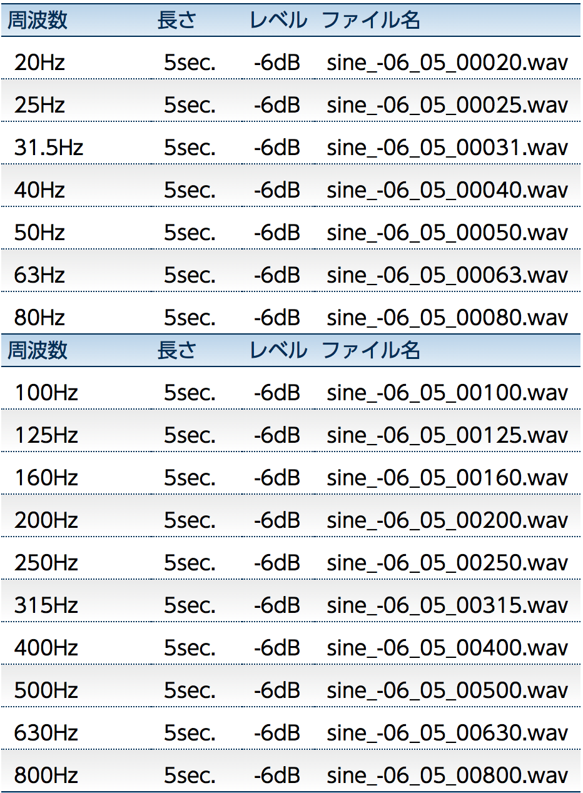
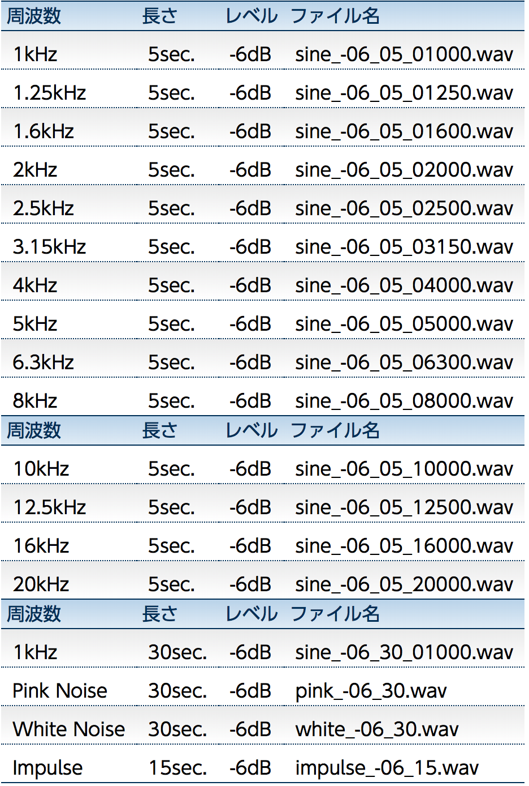

download link : http://mkgweb.undo.jp/local/advan/signwav

サイン波を20Hzから20kHzまで出したwavファイル
sine_-06_30_01000は1kHzサイン波 30秒ver.と、ホワイト/ピンクノイズ、インパルス

---

最初の部分に無音の箇所がある場合があるので波形表示する際に注意
visualizewavfile.pyの例

```python
# 参考URL:http://aidiary.hatenablog.com/entry/20110519/1305808715
import wave
from numpy import *
from pylab import *
%matplotlib inline
import matplotlib.pyplot as plt, librosa, librosa.display, urllib
import os

def printWaveInfo(wf):
    """WAVEファイルの情報を取得"""
    print("チャンネル数:", wf.getnchannels())
    print("サンプル幅:", wf.getsampwidth())
    print("サンプリング周波数:", wf.getframerate())
    print("フレーム数:", wf.getnframes())
    print("パラメータ:", wf.getparams())
    print("長さ（秒）:", float(wf.getnframes()) / wf.getframerate())
    print("\n")

if __name__ == '__main__':
    file_path = "./sin_1kHz~8kHz/sine_-06_05_04000.wav"
    wf = wave.open(file_path, "r")
    print(file_path)
    printWaveInfo(wf)

    buffer = wf.readframes(wf.getnframes())
    print(len(buffer))  # バイト数 = 1フレーム2バイト x フレーム数

    # bufferはバイナリなので2バイトずつ整数（-32768から32767）にまとめる
    data = frombuffer(buffer, dtype="int16")
    # プロット
    #plot(data)
    # 無音でないところを表示
    plot(data[30000:30100])

    show()
```

---

#####ファイルと周波数の対応表

|表1|表2|
| --- | --- |
|||


